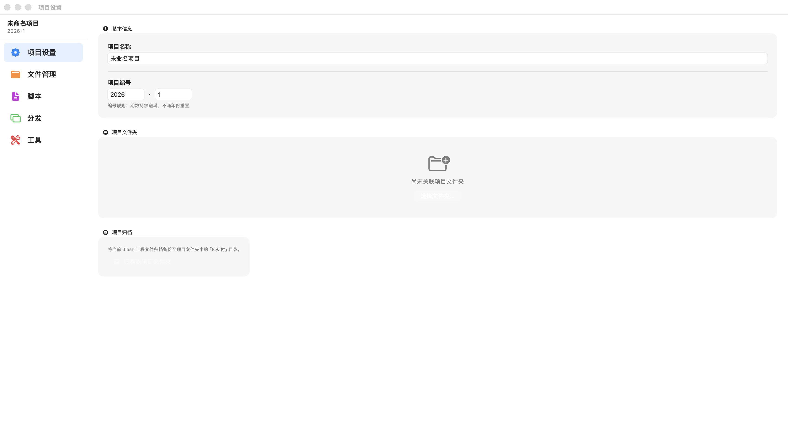
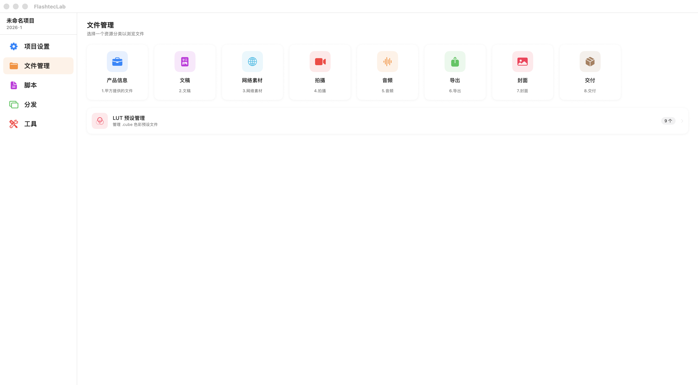
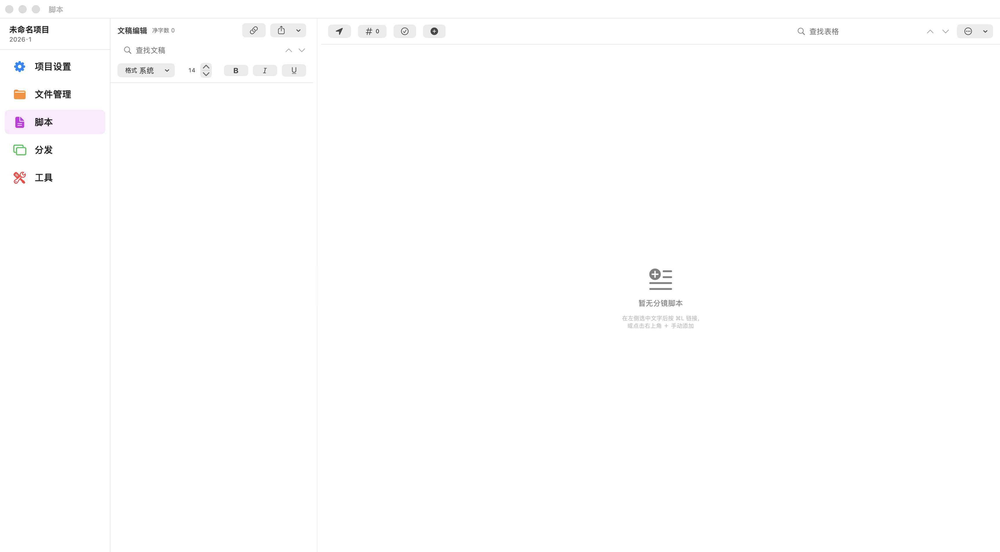
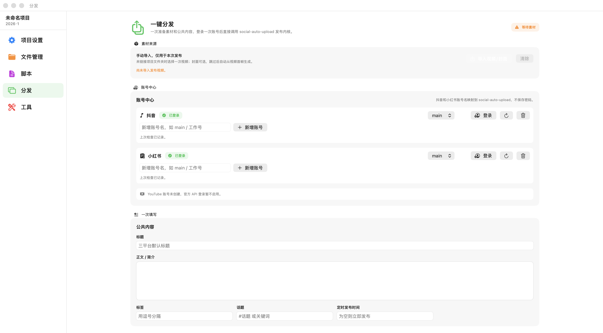
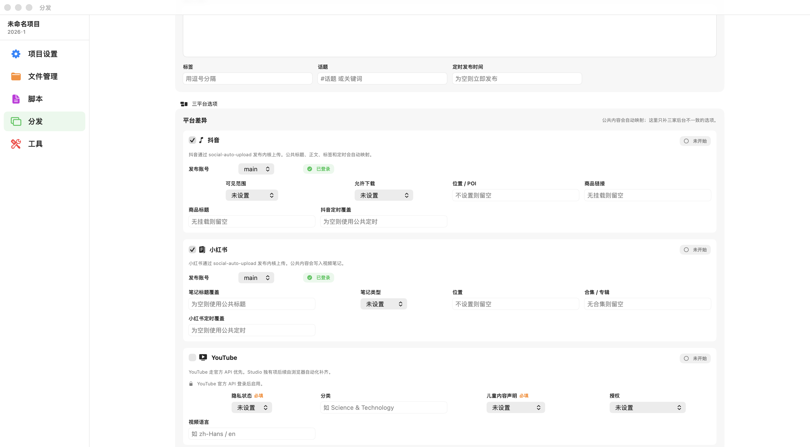
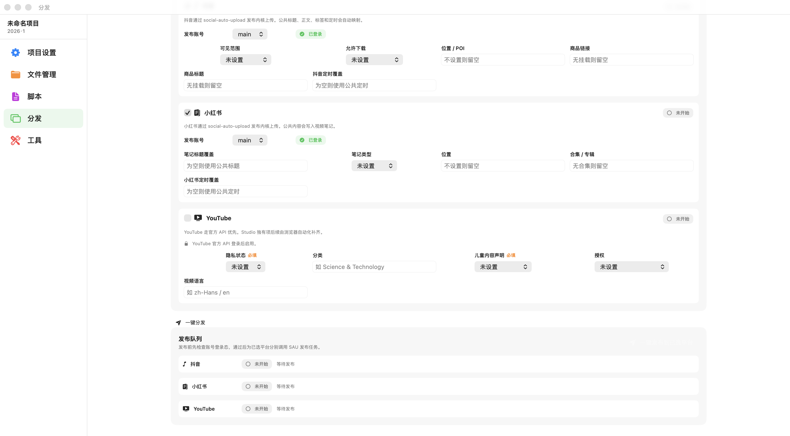

# Self-media tools 使用说明书

适用版本：FlashtecLab 1.2.2。

本说明书使用空白演示项目截图，不包含真实文稿、素材文件或账号隐私。截图中的 `main` 只是账号别名，用于说明账号中心的使用方式。

## 1. 软件定位

FlashtecLab 是面向自媒体生产流程的桌面工具，目标是把“项目设置、文件管理、脚本、素材识别、封面、分发、工具”收进同一个工程。

主要模块：

1. 项目设置：维护项目名称、年份、期数和项目文件夹。
2. 文件管理：按固定目录管理素材、导出、封面和交付文件。
3. 脚本：维护文稿和分镜脚本。
4. 分发：一次准备素材和公共内容，向抖音、小红书、YouTube 创建发布任务。
5. 工具：提供番茄时间、HTML 录屏等辅助工具。

## 2. 安装

1. 打开 [Releases](https://github.com/hmg9909/Self-media-tools/releases)。
2. 下载最新的 `FlashtecLab-1.2.2-macOS.zip`。
3. 解压后把 `FlashtecLab.app` 拖到“应用程序”。
4. 如果 macOS 首次打开提示安全拦截，在“系统设置 - 隐私与安全性”里允许打开。

## 3. 项目设置

项目设置用于决定一个 `.flash` 工程对应哪一期内容。

- 项目名称：显示在侧边栏和工程信息中。
- 项目编号：由年份和期数组成，例如 `2026·1`。
- 项目文件夹：绑定本期内容的真实文件夹。
- 项目归档：把当前 `.flash` 工程备份到项目文件夹的 `8.交付` 目录。

建议每一期内容都绑定独立项目文件夹。绑定后，分发页可以自动识别发布视频和封面。

## 4. 文件管理

文件管理按生产流程划分目录：

| 目录 | 用途 |
| --- | --- |
| `1.甲方提供的文件` | 客户或项目输入文件 |
| `2.文稿` | 文稿、脚本、文字资料 |
| `3.网络素材` | 下载或收集的参考素材 |
| `4.拍摄` | 拍摄素材 |
| `5.音频` | 录音、BGM、音效 |
| `6.导出` | 最终视频导出 |
| `7.封面` | 发布封面 |
| `8.交付` | 最终交付和归档 |

分发功能重点依赖两个目录：

| 目录 | 文件命名 | 用途 |
| --- | --- | --- |
| `6.导出` | `发布视频.*` | 最终发布视频 |
| `7.封面` | `16-9.*` | 16:9 横版封面 |
| `7.封面` | `4-3.*` | 4:3 封面 |

如果文件命名不符合约定，分发页会明确提示缺少素材。

## 5. 脚本

脚本页分为文稿区和分镜表区：

- 左侧文稿区：写正文、口播稿或视频脚本。
- 右侧分镜表：把文稿片段链接到镜头、素材或执行动作。
- 搜索框：分别检索文稿和分镜表。
- 工具按钮：支持链接选中文字、导出文稿、添加脚本行、筛选已完成内容。

空白项目不会显示真实文稿。正式使用时，建议先写完整文稿，再把关键段落拆成分镜表，方便后续素材制作和剪辑。

## 6. 分发总览

分发页的目标是：一次准备内容，一键分发到已选平台。

完整流程：

1. 准备素材。
2. 登录平台账号。
3. 填写公共标题、正文、标签、话题和定时发布时间。
4. 补充平台差异字段。
5. 勾选要发布的平台。
6. 点击“一键发布到已选平台”。
7. 查看每个平台的发布状态和结果。

当前版本中，抖音和小红书走 `social-auto-upload` 发布内核；YouTube 保留官方 API/OAuth 路线，账号未配置前暂不启用。

## 7. 素材来源

### 项目文件夹模式

如果已经绑定项目文件夹，软件会自动读取：

- `6.导出/发布视频.*`
- `7.封面/16-9.*`
- `7.封面/4-3.*`

这种模式适合长期项目管理。视频和封面保留在项目文件夹中，后续复查、交付、归档都更稳定。

### 手动导入模式

如果没有绑定项目文件夹，可以在分发页手动导入一次视频。

- 手动视频只用于本次发布任务。
- 手动素材不写入 `.flash`。
- 没有选择封面时，软件会尝试从视频首帧生成临时封面。
- 三个平台会从同一份临时视频读取并分别上传。
- 三个平台都成功后，临时素材会被清理。
- 有平台失败时，临时素材会短期保留，方便重试。

重开 `.flash` 后，公共字段和平台字段仍会保留，但手动导入的视频需要重新选择。

## 8. 账号中心

账号中心管理平台登录态，不保存明文密码。

常用操作：

- 新增账号：输入账号别名，例如 `main`、`work`。
- 登录：打开对应平台登录流程。
- 刷新：检查登录态是否有效。
- 删除：清除该平台账号的登录态。
- 账号选择器：为当前项目选择使用哪个账号发布。

当前状态：

- 抖音：通过 `social-auto-upload` 管理登录态和上传。
- 小红书：通过 `social-auto-upload` 管理登录态和上传。
- YouTube：等待官方 API/OAuth 账号配置。

登录一次后，只要平台 cookie 没过期，后续打开软件通常不需要重新登录。发布前软件会先检查账号状态，失效时会在上传前拦截。

## 9. 一次填写

公共内容会作为三平台的默认发布内容。

字段包括：

- 标题：视频发布必填。
- 正文 / 简介：映射到平台简介、正文或笔记正文。
- 标签：用逗号分隔。
- 话题：平台话题或关键词。
- 定时发布时间：为空则立即发布。

如果某个平台需要不同标题或特殊选项，可以在“三平台选项”里覆盖。

## 10. 平台差异

公共内容会自动映射，平台差异只补各家后台不一致的字段。

抖音字段：

- 发布账号
- 可见范围
- 允许下载
- 位置 / POI
- 商品链接
- 商品标题
- 抖音定时覆盖

小红书字段：

- 发布账号
- 笔记标题覆盖
- 笔记类型
- 位置
- 合集 / 专辑
- 小红书定时覆盖

YouTube 预留字段：

- 隐私状态
- 分类
- 儿童内容声明
- 授权
- 视频语言

YouTube 账号未配置前不可发布；配置官方 OAuth/API 后再启用。

## 11. 一键分发

点击“一键发布到已选平台”前，软件会先做预检：

- 是否有发布视频。
- 标题是否已填写。
- 选中的平台是否已登录。
- 平台必填字段是否完整。

预检通过后，软件会为每个平台创建独立任务。

任务状态包括：

- 未开始
- 检查账号
- 上传中
- 发布中
- 已提交
- 失败

一个平台失败不会抹掉其他平台的成功结果。失败平台可以单独重试。

## 12. 工具箱

工具箱当前包含：

- 番茄时间：用于专注计时和休息节奏。
- HTML 录屏：把动效网页录制成视频素材。

这些工具不直接影响分发状态，可以按生产流程单独使用。

## 13. 常见问题

### 为什么登录成功后还会发布失败？

登录成功只代表 cookie 有效。真正发布前还需要视频、标题、封面和平台必填字段都完整。

### 为什么提示 title 必填？

视频发布模式下标题是必填项。请先填写公共标题，或填写平台标题覆盖。

### 为什么手动导入素材重开后不见了？

这是设计如此。手动导入素材只用于本次发布任务，不写入 `.flash`，避免工程文件变成素材仓库。

### 为什么 YouTube 不能勾选？

YouTube 账号还没有配置官方 API/OAuth，因此当前禁用。等账号和 API 配置完成后再启用。

### 能不能只给一次视频，一键分发三个平台？

可以。项目文件夹模式下，软件自动识别同一份 `发布视频.*`；手动导入模式下，三个平台也会从同一份临时视频读取并分别上传。你需要一次填写公共内容，再按平台补少量差异字段。

## 14. 推荐工作流

1. 为每期视频创建独立项目文件夹。
2. 在项目设置里绑定项目文件夹。
3. 剪辑完成后，把最终视频放到 `6.导出/发布视频.mp4`。
4. 把封面放到 `7.封面/16-9.png` 和 `7.封面/4-3.png`。
5. 进入分发页，确认素材状态。
6. 检查抖音、小红书账号登录态。
7. 填写公共标题、正文、标签和话题。
8. 补充平台差异字段。
9. 勾选平台，一键发布。
